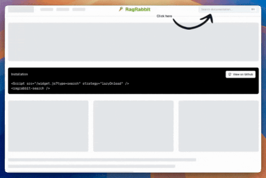
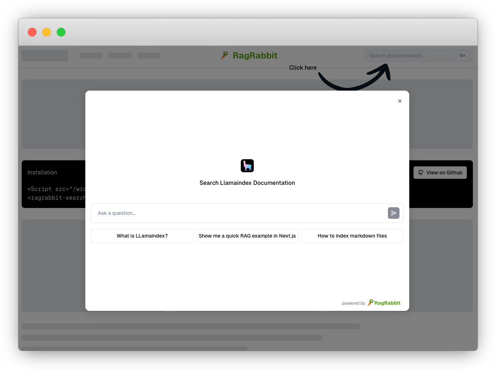
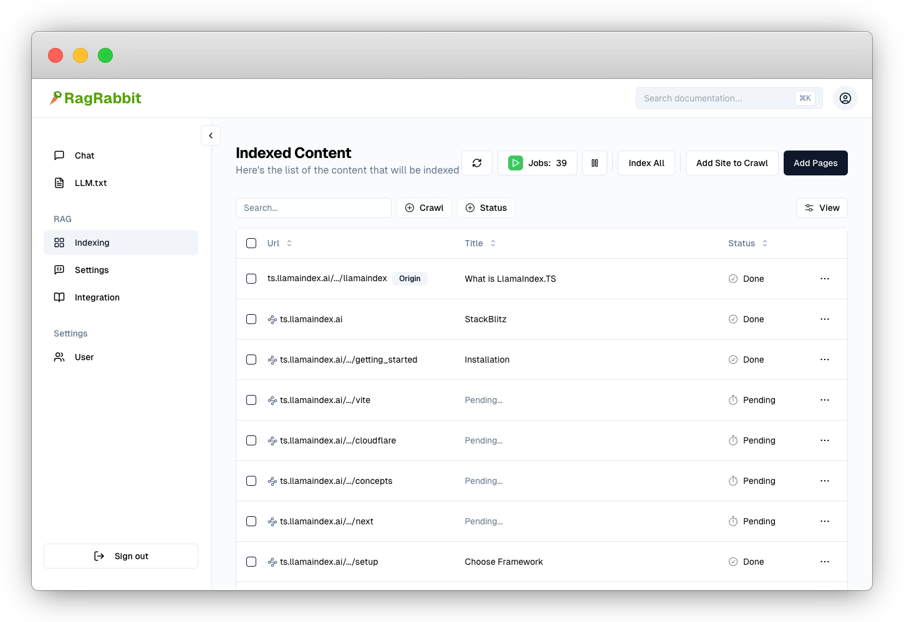
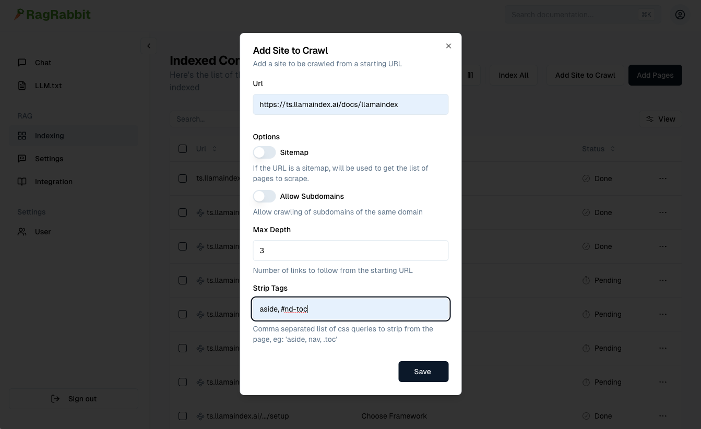
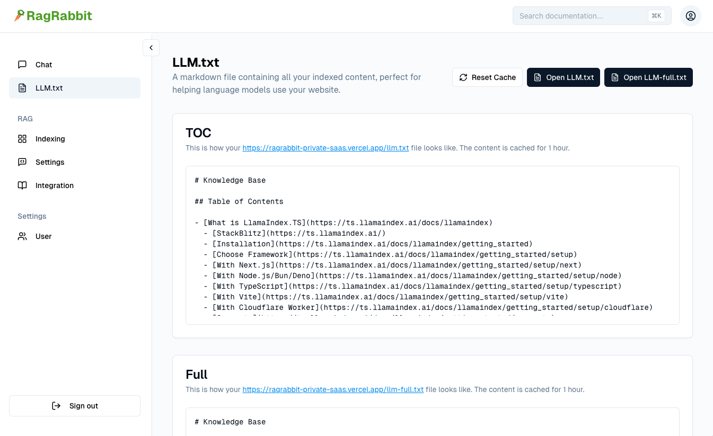

# RagRabbit

Site AI Search and LLM.txt that crawls your site. Easy to fork an customize and deployed on Vercel.

[](https://vercel.com/new/clone?repository-url=https%3A%2F%2Fgithub.com%2Fmadarco%2Fragrabbit&env=OPENAI_API_KEY,AUTH_USERNAME,AUTH_PASSWORD,AUTH_SECRET&envDescription=Get%20an%20OpenAI%20Api%20Key%20and%20set%20AUTH_USERNAME%20and%20AUTH_PASSWORD%20to%20the%20desired%20credentials%20to%20secure%20the%20admin%20section.%20Also%20be%20sure%20to%20enable%20the%20Postgres%20database%20integration&envLink=https%3A%2F%2Fplatform.openai.com%2Fapi-keys&demo-title=RagRabbit%20-%20AI%20Site%20Search%20and%20LLM.txt&demo-description=Site%20AI%20Search%20and%20LLM.txt%20in%20Minutes%2C%20Open%20Source%20with%201%20Click%20Deploy%20on%20Vercel.&demo-url=https%3A%2F%2Fragrabbit.vercel.app%2F&demo-image=https%3A%2F%2Fragrabbit.vercel.app%2Fopengraph-image.png&stores=%5B%7B%22type%22%3A%22postgres%22%7D%5D&root-directory=apps/saas)



## How it works

[RagRabbit](https://github.com/madarco/ragrabbit) is a [Next.js](https://nextjs.org/) [Turborepo](https://turbo.build/repo) app that uses [Llamaindex](https://github.com/run-llama/LlamaIndexTS) with [pgVector](https://github.com/pgvector/pgvector).

It provides:

- chat widget that you can embed in your site
- crawler that scrapes your site recursively and converts the pages to markdown
- exposes a LLM.txt file autogenerated from your content

### Features

- Crawl any url/website
- Convert the pages to markdown
- Generate Vector embeddings on PostgreSQL pgVector
- AI Search and Answers from your content
- Embeddable widget with a simple javascript snippet
- Generate a LLM.txt and LLM-full.txt files
- Supports user/password, magic link, github login
- Open Source, customizable
- 1 Click Deploy on Vercel

### Demo

View [RagRabbit Demo Page](https://ragrabbit.vercel.app/widget/demo)



## Install

To install on Vercel:

[](https://vercel.com/new/clone?repository-url=https%3A%2F%2Fgithub.com%2Fmadarco%2Fragrabbit&env=OPENAI_API_KEY,AUTH_USERNAME,AUTH_PASSWORD,AUTH_SECRET&envDescription=Get%20an%20OpenAI%20Api%20Key%20and%20set%20AUTH_USERNAME%20and%20AUTH_PASSWORD%20to%20the%20desired%20credentials%20to%20secure%20the%20admin%20section.%20Also%20be%20sure%20to%20enable%20the%20Postgres%20database%20integration&envLink=https%3A%2F%2Fplatform.openai.com%2Fapi-keys&demo-title=RagRabbit%20-%20AI%20Site%20Search%20and%20LLM.txt&demo-description=Site%20AI%20Search%20and%20LLM.txt%20in%20Minutes%2C%20Open%20Source%20with%201%20Click%20Deploy%20on%20Vercel.&demo-url=https%3A%2F%2Fragrabbit.vercel.app%2F&demo-image=https%3A%2F%2Fragrabbit.vercel.app%2Fopengraph-image.png&stores=%5B%7B%22type%22%3A%22postgres%22%7D%5D&root-directory=apps/saas)

Requirements:

- Node.js 20.x
- PostgreSQL w/ pgVector
- OpenAI API Key
- (Optional) Trigger.dev API Key

## Configuration

Set the following environment variables:

- OPENAI_API_KEY

For username/password login:

- ADMIN_USER
- ADMIN_PASSWORD

For email login:

- RESEND_AUTH=true

To restrict access to those emails:
RESEND_ALLOWED_EMAILS="test@test.com,foo@bar.com"

To not send emails but logs the login link instead (in Vercel logs):
SIMULATE_EMAILS=true

See [.env.example](./apps/saas/.env.example) for the complete list.

# How to use

Use the Indexing section to add a new url/website to index, either a single url or a website to crawl recursively:




Then start the Job Runner (keep the tab open until it finish)


In the LLM.txt section you can preview the generated LLM.txt file:



You can then embed the widget in your site with the following snippet:

## Chat Button

Embed a button at the bottom of your page:

```
<script src="https://<your deployed app>/widget.js"></script>
```


## Chat Widget

Insert a search input anwhere in your page:


```
<script src="https://ragrabbit.com/widget.js?type=search"></script>
<ragrabbit-search></ragrabbit-search>
```

## To use with React.js

```typescript
"use client";

import Script from "next/script";

export function RagRabbitSearch() {
  return (
    <>
      <Script src="/widget.js?type=search" strategy="lazyOnload" />
      <style>{`
        ragrabbit-search .ragrabbit-search-input {
            padding: 6px 12px;
        }
      `}</style>
      <div className="ml-auto min-w-[300px] flex-1 sm:flex-initial">
        {/* @ts-ignore - Custom element will be mounted by external script */}
        <ragrabbit-search></ragrabbit-search>
      </div>
    </>
  );
}
```

## Configuration Options

### Chat button

You can configure the chat button by adding the following parameters to the widget.js script tag:

#### buttonText

```
<script src="https://ragrabbit.com/widget.js?buttonText=Ask%20AI"></script>
```

### Search widget

You can configure the search widget by adding the following parameters and use the mountSearch call:

#### searchPlaceholder

```
<div id="search-container"></div>
<script>
  window.mountSearch("search-container", { searchPlaceholder: "Search documentation..." });
</script>
```

## Development

```bash
# Start the db (Docker needed)
pnpm dev:utils # Starts postgresql with pgvector, Storybook and Drizzle ORM Studio

# Start the app
cd apps/saas
pnpm dev
```

### Directory structure:

RagRabbit is a monorepo with Turborepo a Next.js app and a modular design with separate packages.

```
apps/
├── docs -> the documentation site
├── saas -> the main application
└── web -> the web site
packages/
├── db -> the database with Drizzle ORM
├── auth -> the authentication with Auth.js
├── core -> shared utils
├── design -> the design system
├── rag -> the LLM and RAG package with LlamaIndexTS
├── jobs -> job runner with Trigger.dev
└── storybook -> a Next.js Storybook app
.cursorrules -> Fine tuned Cursor rules with all the locations to work with the monorepo
```

# Author

[Marco D'Alia](https://www.madarco.net) - [@madarco](https://x.com/madarco) - [Linkedin](https://www.linkedin.com/in/marcodalia/)

# License

MIT
